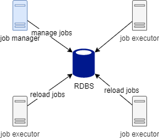
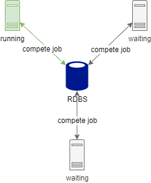

# Event Job

## Cause

想在後臺管理系統介面化管理 **Quartz Job**，就必須將所有 **Job Class** 導入管理系統中，但也強迫系統成為 **Quartz Cluster** 節點之一，導致伺服器資源被 **Job**
占用，所以開發一套基於事件綁定的排程任務管理器，解決任務管理和任務執行的相依性

## Goal

* Separate job managers and executors on different project

## Requirement

* Spring Boot 2+
* Java 8+

## Overview




## QuickStart

### pom.xml

```xml

<dependency>
    <groupId>io.github.babyblue94520</groupId>
    <artifactId>event-job</artifactId>
    <version>0.0.1-SNAPSHOT</version>
</dependency>
```

### yaml

```yaml
event-job:
  instance: eventJobScheduler
  topic: event.jobt
  reload-interval: 60000
  thread-count: 20 # default processors * 2
  shutdown-wait: 180 # second
  persistence: true // persistent jobs to the database, false is only in the memory
  datasource:
    url: jdbc:mysql://192.168.56.101:3306/quartz?characterEncoding=utf-8
    username: root
    password: 123456
    minimum-idle: 1
    maximum-pool-size: 20
    idle-timeout: 300000
    max-lifetime: 1200000
    auto-commit: true
```

### Config

```java

@EnableEventJob
public class EventJobConfig {

}
```

### Create or modify job

```java
@EnableEventJob
public class EventJobConfig {

@Autowired
private Scheduler scheduler;

@Override
public void afterPropertiesSet() throws Exception {
  // 新增任務
  Job job = new Job("group", "name", "event", "description", "+00:00", "0/1 * * * * ?", true, null);
  scheduler.add(job);
}
}
```

### Register job executor

```java
@EnableEventJob
public class EventJobConfig {

  @Autowired
  private Scheduler scheduler;
  
  @Override
  public void afterPropertiesSet() throws Exception {
      scheduler.addExecutor("event",(eventJob)->{
          // TODO
      });
  }
}
```

### Add MessageService

* Notify jobs changes immediately

**Example**

```java
@Log4j2
@Service
public class EventJobMessageServiceImpl extends AbstractEventJobMessageService implements InitializingBean {
    @Autowired
    private StringRedisTemplate stringRedisTemplate;

    @Autowired
    private MyRedisMessageListenerContainer listenerContainer;

    @Autowired
    private DefaultClientResources defaultClientResources;

    @Override
    public void afterPropertiesSet() throws Exception {
        defaultClientResources.eventBus().get().subscribe((event) -> {
            if (event instanceof ConnectedEvent) {
                publishConnectedEvent();
            }
        });
    }

    @Override
    public void send(String topic, String body) {
        stringRedisTemplate.convertAndSend(topic, body);
    }

    @Override
    public void addListener(String topic, Consumer<String> listener) {
        listenerContainer.addMessageListener((message, pattern) -> {
            listener.accept(new String(message.getBody()));
        }, new PatternTopic(topic));
    }
}
```
